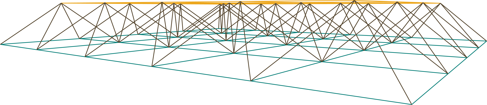
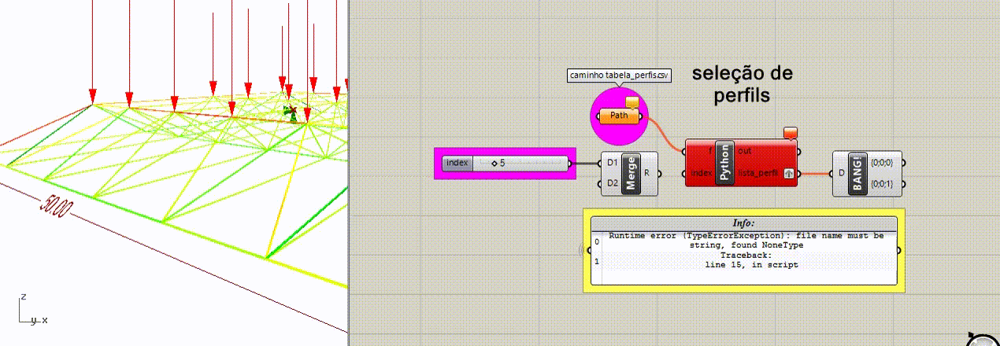
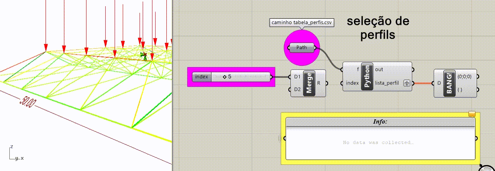
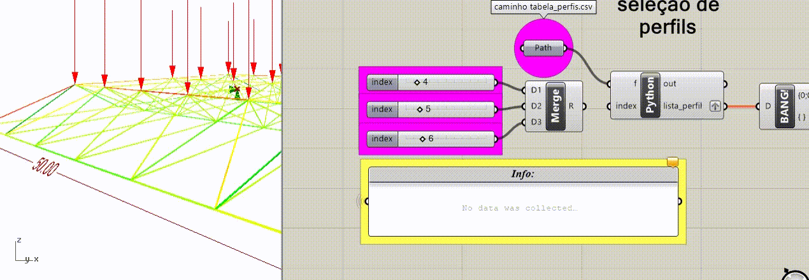
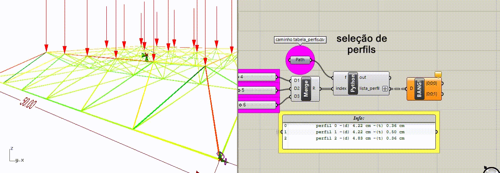
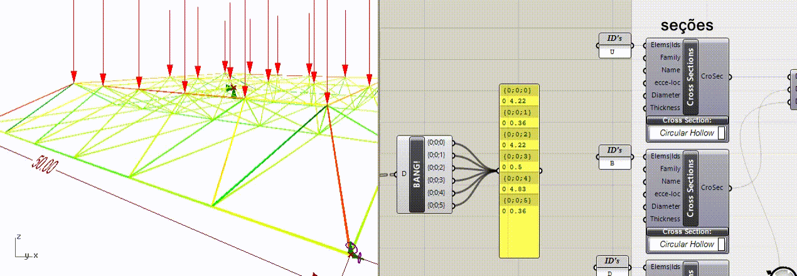
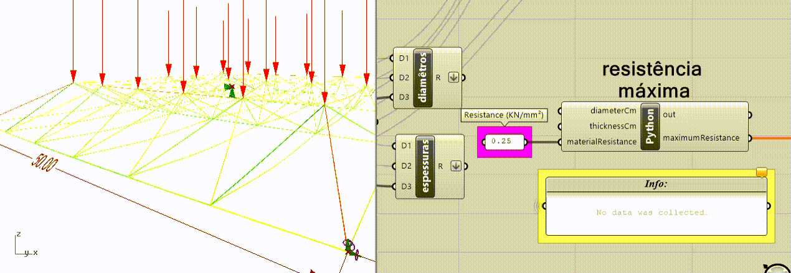

# truss_analysis
Template para automatizar análise estrutural de treliças metálicas no ambiente Grasshopper + Karamba 3D


Neste repositório você encontrará um template escrito em Python para automatizar projetos de treliças metálicas constituídas de barras tubulares, de acordo com a norma brasileira NBR8800/86.

O objetivo principal deste template é servir de ferramenta computacional para disseminar a utilização de scripts para solucionar problemas, ou ainda, automatizar tarefas entre arquitetos e engenheiros projetistas, assim como auxiliar o aprendizado de estudantes de estruturas metálicas.

Dividos em três partes (blocos A, B e C), o template funciona da seguinte maneira:

1. bloco A - busca opções de seções de perfils em uma tabela tipo .csv (arquivos de texto com valores separados por vírgulas);

2. bloco B - calcula a resistência máxima dos perfis selecionados no bloco anterior;

3. bloco C - verifica as condições de seguranças exigidas pela NBR8800/86, ou seja, se a solicitação máxima de cada perfil escolhido é menor ou igual sua resistência máxima. 

Como exemplo, veremos um caso de uma treliça espacial plana (imagem abaixo),  constituída por três diferentes seções (banzo superior, banzo superior e diagonal) e desenvolvida no ambiente rhinoceros + karamba. 





### Exemplo de aplicação

Neste exemplo, foram utilizados os seguintes add-on para Grasshopper 3d:

1. [karamba 3d](https://www.food4rhino.com/app/karamba3d) - aplicativo para análise estrutural; 

2. [ghpython](https://www.food4rhino.com/app/ghpython) - interpretador Python para o Grasshopper.


Modelos definidos, agora vamos ver como utilizar o template..


#### Bloco A

A primeira coisa é decidir com quantos tipos de perfis pretendemos trabalhar. Neste caso, utilizaremos três seções diferentes, uma para as barras do banzo superior, outra para as barras do banzo inferior e outra para as diagonais.


Em seguinda, podemos mostrar o caminho que o script deverá fazer para ler a tabela de perfis.



obs.: neste tabela, adotamos os 30 perfis mais frequentemente produzidas pela empresa [Vallourec](http://www.vallourec.com/COUNTRIES/BRAZIL/PT/Products-and-services/automotive-industrial-tubes/Documents/Catalogo%20Estruturais.pdf).

O próximo passa foi definir um controle deslizante de números para cada seção. Lembre-se de edita-los ao tamanho da tabela de seções.



Para que o interpretador Python do ambiente Grasshopper funcione bem, devemos informar corretamente o tipo de entradas que ele receberá. 

``` 
BLOCO_A
    INPUTS:
        f     --> Item access --> type: ghdoc (rhinoscriptsyntax)
        index --> um (01) perfil   : Item access --> type: int
                  dois ou n perfis : List access --> type: int
```





Pronto, já podemos ver a resposta:

```
    OUTPUTS:
        out  --> informações visuais (perfi(s), diâmetro(s) e espessura(s))
        lista_perfil --> lista de diâmetro(s) e espessura(s) dos perfis
```




Estas saídas devem ser ligadas ao nó karamba




#### Bloco B

As mesmas saídas ligas ao Karamba também precisam ser ligadas as entradas (diâmetro e espessura) do bloco B. Isso porque, este bloco é que irá calcular a resistência máxima de cada seção escolhida no bloco anterior


Veja só os resultados na saída do bloco.



#### Bloco C

Por fim, precisamos alimentar o último bloco do template. Ele será o responsável por acusar quais seções atendem a exigência da norma descrita anteiormente.

Para isso, buscamos as solicitações de todas as barras diferentamente nos nós karamba.


Em seguidas, precisamos informar quantas barras têm no modelo (número de barras no banzo superior, inferior e diagonal).


Por fim, está feito. É só experimentar quais as seções atende ao nosso projeto.


#### Atenção

É claro que está é uma análise preliminar e não atende todas as exigências contidas na NBR8800/86, mas, é uma boa maneira de ganhar tempo evitando recalcular seções de perfis durante o projeto. 


### Gostou?

Link para baixar o template e exemplo [AQUI](https://github.com/renatogcruz/truss_analysis/tree/master/files).

Sinta-se a vontade para baixar, usar e modificar este template.
